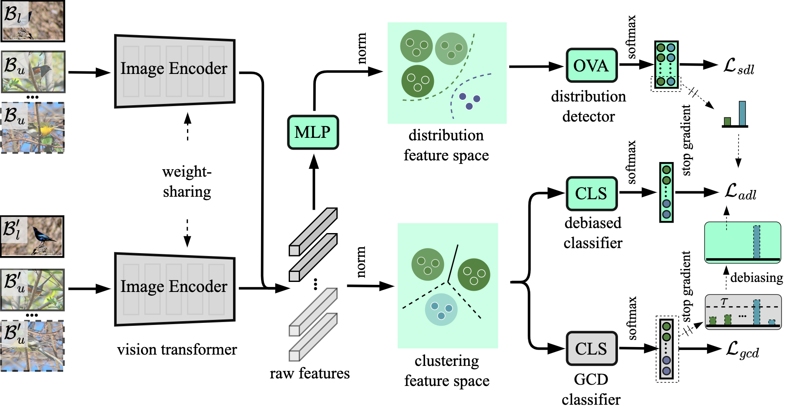

#  DebGCD: Debiased Learning with Distribution Guidance for Generalized Category Discovery (ICLR 2025)


<p align="center">
    <a href="https://arxiv.org/abs/2504.04804"></a>
    <a href="https://visual-ai.github.io/debgcd/"></a>
    <a href="#jump"></a>
</p>
<p align="center">
	DebGCD: Debiased Learning with Distribution Guidance for Generalized Category Discovery <br>
  By
  Yuanpei Liu and 
  Kai Han.
</p>

<p align="center">
  
</p>


## Prerequisite 🛠️

First, you need to clone the DebGCD repository from GitHub. Open the terminal and run the following command:

```
git clone https://github.com/Visual-AI/DebGCD.git
cd DebGCD
```

We recommend setting up a conda environment for the project:

```bash
conda create --name=debgcd python=3.8
conda activate debgcd
pip install -r requirements.txt
```

## Running 🏃
### Config

Set paths to datasets, pretrained weights, and log directories in ``config.py``


### Datasets

We use generic object recognition datasets, including CIFAR-10/100 and ImageNet-100:

* [CIFAR-10/100](https://pytorch.org/vision/stable/datasets.html) and [ImageNet-100](https://image-net.org/download.php)

We also use fine-grained benchmarks (CUB, Stanford-cars, FGVC-aircraft). You can find the datasets in:

* [The Semantic Shift Benchmark (SSB)](https://github.com/sgvaze/osr_closed_set_all_you_need#ssb)


### Scripts
We use the slurm system to run the code. The scripts to train and eval each method can be found in the folder `/scripts`. For example, to train and eval on CUB dataset.

**Eval the model**
```
sbatch scripts/eval_DebGCD.cmd cub v1 0.1 2.0
```

**Train the model**:

```
sbatch scripts/train_DebGCD.cmd cub v1 0.1 2.0 0.3
```
Just change the dataset name (``cub``), its corresponding DINO version (``v1``) and the hyperparameters.


## Citing this work
<span id="jump"></span>
If you find this repo useful for your research, please consider citing our paper:

```
@inproceedings{liu2025debgcd,
  title={DebGCD: Debiased Learning with Distribution Guidance for Generalized Category Discovery},
  author={Liu, Yuanpei and Han, Kai},
  booktitle={ICLR},
  year={2025}
}
```